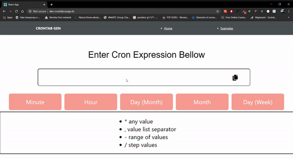

# Cron-Generator


[](https://twitter.com/intent/tweet?text=Wow:&url=https%3A%2F%2Fgithub.com%2Fdev2919%2FCron-Generator%2Fblob%2Fmaster%2FREADME.md)



 ## Technologies used

- [React](https://reactjs.org/) single page application
- Routing done using [React Router](https://reacttraining.com/react-router/web/guides/philosophy)
- Cron parsing using [cronstrue](https://www.npmjs.com/package/cronstrue)

## Setup

1. Clone the repository and install the dependencies
```bash
npm install
```
2. Start the frontend application locally
```bash
npm start
```

Runs the app in the development mode.<br />
Open [http://localhost:3000](http://localhost:3000) to view it in the browser.

The page will reload if you make edits.<br />
You will also see any lint errors in the console.

## CSS preprocessor

This project implements [SASS](http://sass-lang.com/) via [node-sass](https://github.com/sass/node-sass), as per the suggestion of [Create React App's documentation](https://github.com/facebook/create-react-app/blob/master/packages/react-scripts/template/README.md#adding-a-sass-stylesheet).

The styles for each component are therefore located in their corresponding `<component_name>.scss` file.

There's also a utility folder under `src/styles`. The folder contains some common variables, mixins and other stuff that is meant to be reused from other SASS files. You import these styles from another .scss file by doing:

```css
@import 'styles/main.scss';
```


## Routes

This project is using [`react-router-dom v4`](https://reacttraining.com/react-router/core), have a look at `Routes.jsx` which is the file that defines the routes that are available.

## Author

Devesh Pawar <dev2919@gmail.com> http://github.com/dev2919

## License

 - **MIT** : http://opensource.org/licenses/MIT

This app was bootstraped based on the template provided by create-react-app
